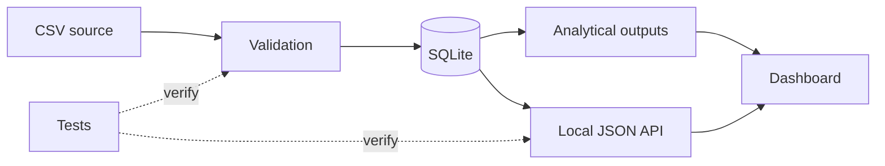

# ZIPSmart Dashboard

### Interactive Reporting · Validated Data · Decision Support

**The presentation layer for the ZIPSmart360 analytical pipeline, designed to keep visualization downstream of validation, storage, and analytical logic.**

[Working project](https://github.com/JJennings728/ZipSmart360) · [Dashboard source](https://github.com/JJennings728/ZipSmart360/blob/main/web/dashboard.html) · [Portfolio](https://github.com/JJennings728/ZipSmart360/blob/main/PORTFOLIO.md)

## Overview

This repository serves as the dashboard entry point for ZIPSmart360.

The active dashboard is maintained inside [JJennings728/ZipSmart360](https://github.com/JJennings728/ZipSmart360) so that data generation, validation, API behavior, and presentation remain aligned in one executable project.


## Architecture



**Design rule:** the dashboard displays validated analytical output; it does not define the underlying analytical truth.

## Dashboard capabilities

- state filtering;
- ZIP-prefix filtering;
- preservation of leading-zero ZIP identifiers;
- responsive tabular presentation;
- explicit synthetic-data labeling; and
- offline viewing after the build is generated.

## Run locally

The dashboard is generated and served from the main ZIPSmart360 repository.

### Prerequisites

- Python 3.10+
- Git
- A modern web browser

### 1. Clone ZIPSmart360

```bash
git clone https://github.com/JJennings728/ZipSmart360.git
cd ZipSmart360
```

### 2. Build the data

```bash
python zipsmart.py
```

### 3. Start the local server

```bash
python server.py
```

Open:

```text
http://127.0.0.1:8000
```

Or open the generated `build/dashboard.html` directly.

On Windows, `py` can be used instead of `python`.

## Data flow

| Layer | Responsibility |
| --- | --- |
| Source | Synthetic demonstration records |
| Validation | Reject malformed or semantically invalid records |
| Storage | Preserve validated records in SQLite |
| Analytics | Produce explicit SQL/Python outputs |
| API | Expose validated records through local JSON endpoints |
| Dashboard | Present downstream data for review |

## Related artifacts

- [ZIPSmart360 source](https://github.com/JJennings728/ZipSmart360)
- [Architecture](https://github.com/JJennings728/ZipSmart360/blob/main/docs/architecture.md)
- [Data dictionary](https://github.com/JJennings728/ZipSmart360/blob/main/docs/data-dictionary.md)
- [Saved example output](https://github.com/JJennings728/ZipSmart360/blob/main/examples/dashboard.html)
- [Portfolio](https://github.com/JJennings728/ZipSmart360/blob/main/PORTFOLIO.md)

## Status and limitations

This repository is a **navigation and presentation repository**, not a separately deployed application.

The dashboard uses synthetic data and does not represent a production risk score, insurer system, underwriting model, or hosted commercial service.

## Author

**James Jennings**  
Applied AI · Risk Analytics · Data Engineering · Insurance

[LinkedIn](https://www.linkedin.com/in/james-jennings-2053b4a8) · [GitHub](https://github.com/JJennings728)
